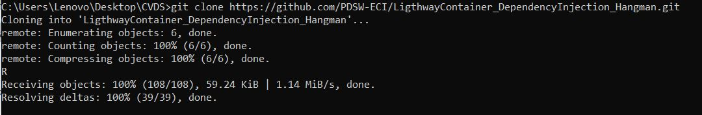
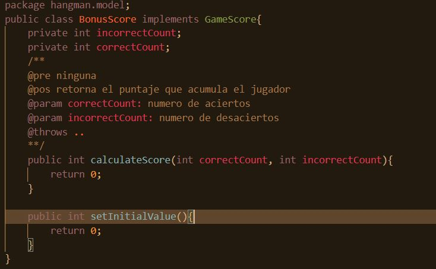
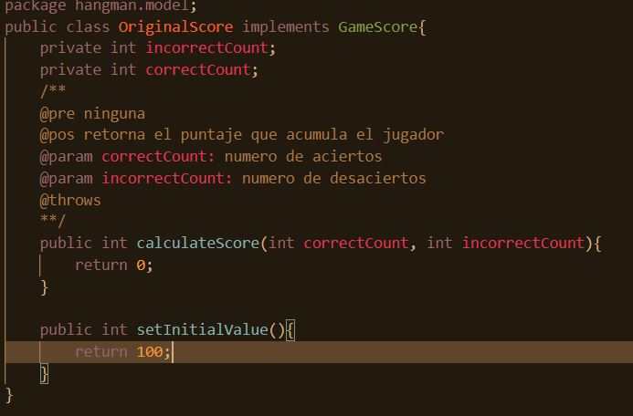
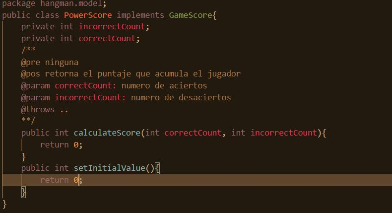
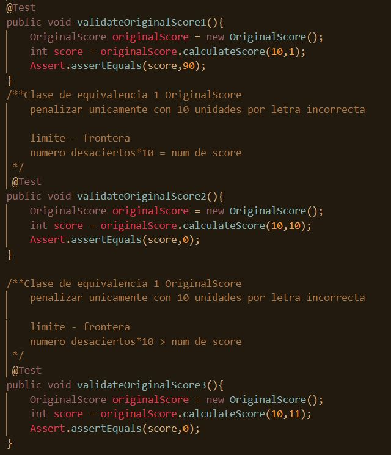
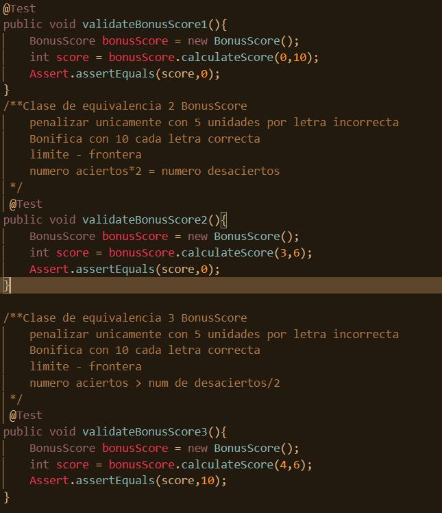
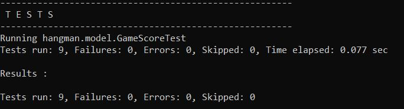

### Escuela Colombiana de Ingeniería

### Ciclos de Vida de Desarrollo de Software

### Steven Garzón & Johan Garcia Martínez

### Laboratorio 4

*Punto1 : Clone el proyecto*

*Punto 2,3,4 : especificación y commit*

## Clases de equivalencia y fronteras para cada calculadora
*OriginalScore*

*BonusScore*

*PowerBonusScore*

## Resultado de los Test

