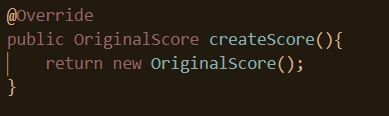
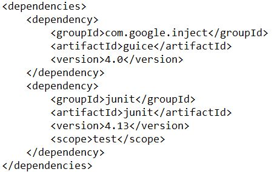
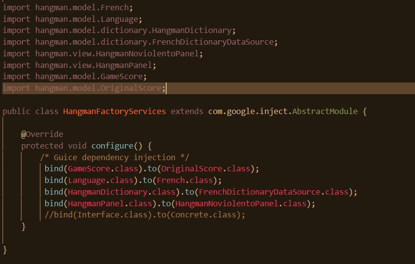

### Escuela Colombiana de Ingeniería

### Ciclos de Vida de Desarrollo de Software

### Steven Garzón & Johan Garcia Martínez

### Laboratorio 4

*Punto1 : Clone el proyecto*

*Punto 2,3,4 : especificación y commit*

## Clases de equivalencia y fronteras para cada calculadora
*OriginalScore*

*BonusScore*

*PowerBonusScore*

## Resultado de los Test

# PARTE 2

# 1. Utilizando el HangmanFactoryMethod incluya OriginalScore a la configuración

*Adicionalmente importamos las clases necesarias para que se cumpliera*

# Inyección de dependecia GUICE al pom.xml

*Mediante la inyección de dependencias se cambió el comportamiento  donde se utilizó el idioma frances, el tipo de Score .OriginalScore , el diccionario francés y el panel hangman no violento*

